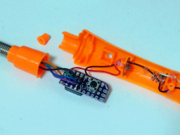

# ATtiny85SwingPOV

This is a POV (persistence of vision) display by human-powered swinging.

3 demonstrations are available and it's changed by pressing the button.

* Message mode: display the letters "ATtiny85SwingPOV" with scrolling.
* Counter mode: display the number of how many time it's swinged.
* Graphic mode: various colored OBONOs move up repeatedly.

## Hardware

### Components

* [ATtiny85](https://akizukidenshi.com/catalog/g/g109573/)
* Optical tilt sensor: [RBS32](https://akizukidenshi.com/catalog/g/g102742/)
* NeoPixel Stick (WS2812 &times; 8)
* Resistors: 220&ohm; and 15k&ohm;
* Wires, connectors, a button, a switch, etc...

### Schematic

### Example

## Software

### Build environment

[Install ATTinyCore boards to the Arduino IDE](https://github.com/SpenceKonde/ATTinyCore/blob/v2.0.0-devThis-is-the-head-submit-PRs-against-this/Installation.md) and configure the settings as follows.

Attribute         |Value
------------------|------------------------------
Board             |ATtiny25/45/85 (No bootloader)
Chip              |ATtiny85
Clock Source      |8 MHz (Internal)
Timer 1 Clock     |CPU (CPU frequency)
LTO (1.6.11+ only)|Enabled
millis()/micros() |Enabled
Save EEPROM       |EEPROM not retained
B.O.D. Level      |B.O.D. Disabled (saves power)

This sketch depends on following library. (You can add this by library manager)

* [Adafruit NeoPixel](https://github.com/adafruit/Adafruit_NeoPixel)

Also, you should modify ["SwingPov.cpp"](SwingPov.cpp) depending on your hardware.

* `SWING_TIME_MIN` and `SWING_TIME_MAX`: The threshold of each swing time in msec.
* `SWING_PHASE_ADJUST`: The delay to toggle the direction after sensing tilt change by the percentage of each swing time.

### License

These codes are licensed under [MIT License](LICENSE).
